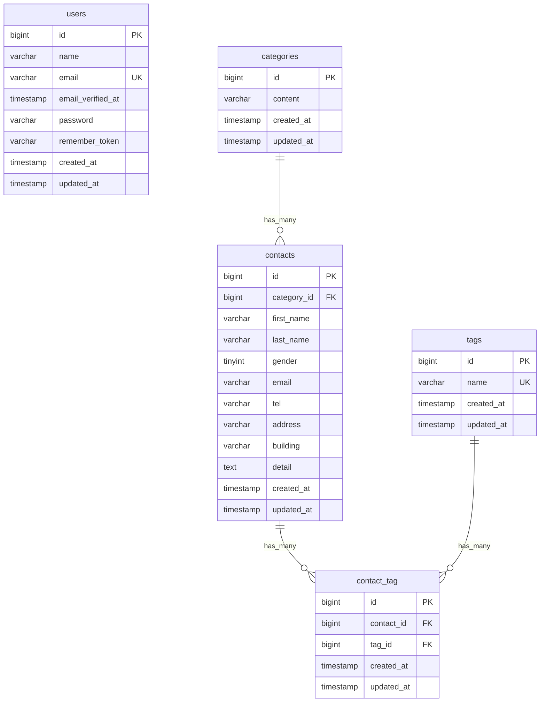

# ER図

```mermaid
erDiagram
    users {
        bigint id PK
        varchar name
        varchar email UK
        timestamp email_verified_at
        varchar password
        varchar remember_token
        timestamp created_at
        timestamp updated_at
    }

    categories {
        bigint id PK
        varchar content
        timestamp created_at
        timestamp updated_at
    }

    contacts {
        bigint id PK
        bigint category_id FK
        varchar first_name
        varchar last_name
        tinyint gender
        varchar email
        varchar tel
        varchar address
        varchar building
        text detail
        timestamp created_at
        timestamp updated_at
    }

    tags {
        bigint id PK
        varchar name UK
        timestamp created_at
        timestamp updated_at
    }

    contact_tag {
        bigint id PK
        bigint contact_id FK
        bigint tag_id FK
        timestamp created_at
        timestamp updated_at
    }

    categories ||--o{ contacts : has_many
    contacts ||--o{ contact_tag : has_many
    tags ||--o{ contact_tag : has_many
```